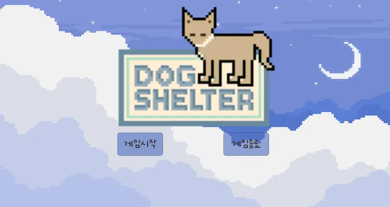
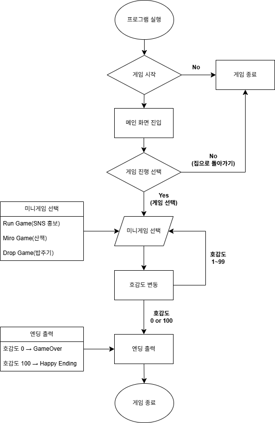

# 📒 [Notion Page](https://www.notion.so/DogShelter-20b73547a88280e9a428d5b2226c4a02)

⚙️ Unity Version: 2021.3.14f1  
⚙️ Visual Studio 2022  
⚙️ Window 10  
⚙️ Package   
[1. Pixel Skies DEMO Background pack](https://assetstore.unity.com/packages/2d/environments/pixel-skies-demo-background-pack-226622?locale=ko-KR&srsltid=AfmBOopSFS-Bbl1-gaR8CGsPHXf9fYHMwBRggQfXX-dV5_w72N5IR7VV)  
[2. Roguelike Indoors](https://kenney.nl/assets/roguelike-indoors)  
[3.Roguelike Modern City](https://kenney.nl/assets/roguelike-modern-city)  
[4. RPG Urban Pack](https://kenney.nl/assets/rpg-urban-pack)  
    
# DogShelter




## 서비스 소개  

유기견 보호소 방문 경험을 바탕으로 기획한 2D 육성 게임입니다. 플레이어는 미니게임을 통해 강아지와 호감도를 높이고, 그 결과에 따라 엔딩을 경험하게 됩니다. 게임을 통해 유기동물 봉사활동에 대한 이해와 관심을 유도하는 것이 목적입니다.  

## 주요 기능

### ✅ 메인화면
### ✅ 호감도 시스템
### ✅ 미니 게임 3종 선택가능
### ✅ 미니 게임1_Run (SNS 홍보)
### ✅ 미니 게임2_Miro (산책)
### ✅ 미니 게임3_Drop (밥주기)
### ✅ 호감도 결과에 따른 엔딩 출력

### FlowChart



### Asset 제작

Dog, Player, Log 등 일부 게임에 맞는 에셋 제작


## 트러블 슈팅 (1/2)
<details>
🚨 문제 배경

프로젝트를 여러개의 Scenes으로 구성하였고, 이 과정에서 Scenes 전환 시 호감도의 값이 초기화 되는 문제 발생.

💡 해결방법

호감도 관리 스크립트를 Singleton Pattern 적용. 스크립트를 다른 스크립트에서 호출시 초기화 되지 않고 누적 되는 것 정상 확인.

1. Debug.log() 로 미니 게임 결과에 따라 호감도 값이 변동되는지 출력 되는지 파악
    
    ```csharp
    void Start()
        {
            goal = false;
            nowLove = FindObjectOfType<Likeability>();
            //Likebility 스크립트는 동일 씬에 컴포넌트 되지 않음 → 찾기위해서는 GameObject.Find("객체명")로 찾을 수 없음
    
            if(nowLove == null )
            {
                Debug.Log("호감도 스크립트 찾지 못함");     //확인용
            }
    
        }
    ```
    
2. Singleton 적용 : 호감도 관리 스크립트(Likeability)를 Instance화 해서 호출하는 방식으로 수정
    
    ```csharp
    public class Likeability : MonoBehaviour
    {
        /// <summary>
        /// Singleton Pattern 활용
        /// 1. 씬전환시 변수(nowLove)가 초기화 되는 상황을 방지
        /// 2. 컴포넌트 되지 않은 씬에 적용된 Goal 스크립트에서 참조가능하도록 관리
        /// 3. Awake() 함수 사용은 스크립트간의 참조를 설정하기 위함 = 초기화되지 않고 호출해주는 역할
        ///    start함수가 호출되기 전에 씬에 모든 객체에 대해 호출!!
        /// 4. Destroy() 삭제 키워드 / DontDestroyOnLoad()삭제 제외 키워드
        ///    →씬 전환시 게임 오브젝트가 삭제(초기화) 되기 때문에 상단 키워드를 사용!!
        /// 5. 최소 호감도를 -10으로 설정한 이유는 초기 호감도가 0이기 때문
        ///    → 게임 시작시 종료되는 상황 방지 && 호감도 0이더라도 1번의 기회 더 제공하기 위함
        /// </summary>
        /// 
        public static Likeability Instance;           //static 사용하여 Goal스크립트에서 접근하도록 instance 선언
    
        public float nowLove;                         //Goal 스크립트에서 실질적으로 접근할 변수(현재 호감도)
        float maxLove = 100f;                         //호감도의 최대값
    
        UnityEngine.UI.Slider LoveSlider;
        
    
        private void Awake()
        {
            if(Instance != null)                      //접근하려는 스크립트에 Instance가 존재하는지 검사
            {
                Destroy(gameObject);                  //Goal스크립트에 이미 Likeability를 게임오브젝트로 가지고 있다면 삭제(충돌방지)
                return;
            }
            Instance = this;                          //this 클래스의 현재 객체를 뜻하는 키워드 = 자기자신을 값으로 넣어줌
            DontDestroyOnLoad(this.gameObject);  // 씬 전환이 되어도 Instance가 초기화 되는 걸 방지
            Debug.Log("Likeability 싱글톤 인스턴스 생성됨: " + Instance);
        }
    ```
    
    ```csharp
    void Start()
        {
            goal = false;
            nowLove = Likeability.Instance;          //Likeablilty Singleton 적용
    
            if(nowLove == null )
            {
                Debug.Log("호감도 스크립트 찾지 못함");
            }
    
            else         //확인용
            {
                Debug.Log("호감도 스크립트 찾음: " + nowLove);
            }
    
        }
    ```
    </details>

## 트러블 슈팅 (2/2)
<details>
🚨 문제 배경

호감도를 관리하는 스크립트에서 호감도를 표현하는 UI(Slider)를 찾아오지 못하는 오류 발생. 1차 오류 해결하였으나, 미니게임으로 씬 전환시에도 UI가 생성되는 문제가 추가 발생

💡 해결방법

1차 오류 : 호감도를 표현하는 UI를 2개로 분리(Button, Slider) 하고 호감도를 표현해야하는 Object에서 Slider를 직접 찾을 수 있게 자식객체로 수정.

1. 호감도 관리 스크립트에 Debug.log()를 추가하고, UI를 찾아오면 호감도가 실행되도록 함수 추가
Start() 함수에서 실행시 UI를 잘 찾아오는 것을 추가 확인하여 객체 생성순서의 문제임을 파악
    
    ```csharp
    public void UpdateLove()
        {
            //문제확인완료되면 이걸로 LoveSlider.value = nowLove;                       //UI Value의 값에 현재 호감도를 반영
    
            if (LoveSlider == null)
            {
                Debug.Log("LoveSlider가 null입니다.");
                return;
    
            }
    
            LoveSlider.value = nowLove;
    
            if (nowLove == -10)
            {
                SceneManager.LoadScene("GameOver");              //호감도 -10일시 게임오버씬으로 전환
            }
    
        }
    ```
    
2. 씬 전환시 객체가 파괴되지 않도록 호감도 스크립트가 적용된 객체의 하위 객체로 위치 변경

2차 오류 : 현재씬 정보를 가져오는 내장함수 GetActiveScene() 을 활용, Main씬인 경우에만 Slider 표기

1. 현재씬의 정보를 가져오는 내장함수 GetActiveScene() 을 활용, Main씬인 경우에만 Slider 표기
update 함수를 활용해서 계속 반복 실행하도록 지정
    
    ```csharp
        string nowScenename;                         //현재씬을 저장 할 변수 생성
        
        private void Awake()
        {
            if(Instance != null)                      //접근하려는 스크립트에 Instance가 존재하는지 검사
            {
                Destroy(gameObject);                  //Goal스크립트에 이미 Likeability를 게임오브젝트로 가지고 있다면 삭제(충돌방지)
                return;
            }
            Instance = this;                          //this 클래스의 현재 객체를 뜻하는 키워드 = 자기자신을 값으로 넣어줌
            DontDestroyOnLoad(this.gameObject);  // 씬 전환이 되어도 Instance가 초기화 되는 걸 방지
            Debug.Log("Likeability 싱글톤 인스턴스 생성됨: " + Instance);
    
            Start();
            Debug.Log("LoveSlider 초기화 완료");
    
            Update();        //추가
            Debug.Log("Slider 활성화 여부 판단 완료");
    
        }
        
        
        private void Update()
        {
            string nowScenename = SceneManager.GetActiveScene().name;                     //현재 활성화된 씬의 이름을 가져옴\
    
            if (nowScenename == "Main")
            {
                LoveSlider.gameObject.SetActive(true);
                Debug.Log("Main 씬 Slider 활성화");
                return;
            }
    
            if (nowScenename != "Main")
            {
                LoveSlider.gameObject.SetActive(false);
                Debug.Log("Main 씬 아닐시 Slider 비활성화");
            }
    
        }
    ```
    </details>

